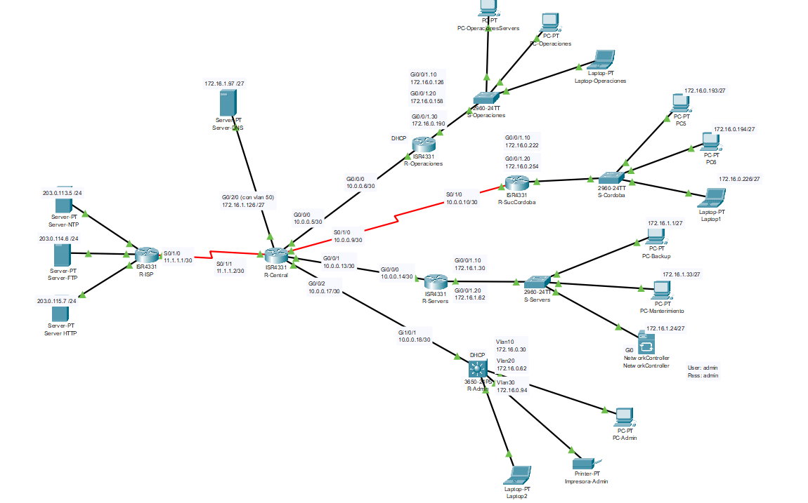

# Cisco Packet Tracer API


## Inicio

### 1. Activar entorno y ejecutar demo completa
```powershell
cd d:\code\facultad\redes\apiPython
.\venv\Scripts\activate
cd src
python demo_all_crud.py
```

### 2. Ejecutar scripts individuales
```powershell
# Network Devices (6 endpoints)
python crud_network_devices.py

# Hosts (4 endpoints)
python crud_hosts.py

# Users (5 endpoints)
python crud_users.py

# Discovery (6 endpoints)
python crud_discovery.py

# Policy Tags (4 endpoints)
python crud_policy_tags.py
```

## Autenticacion

```python
from api_client import CiscoAPIClient

client = CiscoAPIClient()
# El ticket se obtiene automaticamente
```

## Ejemplos Rapidos

### Network Devices
```python
from crud_network_devices import *
from api_client import CiscoAPIClient

client = CiscoAPIClient()

# Listar todos
get_all_network_devices(client)

# Agregar nuevo
create_network_device(client, "192.168.1.1")

# Obtener por IP
get_network_device_by_ip(client, "192.168.1.1")

# Actualizar
update_network_device(client, "device-id")

# Eliminar
delete_network_device_by_ip(client, "192.168.1.1")
```

### Hosts
```python
from crud_hosts import *

# Contar
get_host_count(client)

# Listar
get_all_hosts(client)

# Por IP
get_host_by_ip(client, "172.16.1.30")

# Eliminar
delete_host_by_ip(client, "172.16.1.30")
```

### Users
```python
from crud_users import *

# Crear
create_user(client, "testuser", "Pass123!", "ROLE-OBSERVER")

# Listar
get_all_users(client)

# Obtener
get_user(client, "testuser")

# Actualizar
update_user(client, "testuser", new_password="NewPass!")

# Eliminar
delete_user(client, "testuser")
```

### Discovery
```python
from crud_discovery import *

# Crear
create_discovery(client, "My-Discovery", "192.168.1.1-192.168.1.50")

# Listar
get_all_discoveries(client)

# Por ID
get_discovery_by_id(client, "disc-id")

# Actualizar
update_discovery(client, "disc-id", name="New-Name")

# Eliminar
delete_discovery_by_id(client, "disc-id")
```

### Policy Tags
```python
from crud_policy_tags import *

# Crear
create_policy_tag(client, "My-Tag", "Description")

# Listar
get_all_policy_tags(client)

# Contar
get_policy_tags_count(client)

# Eliminar
delete_policy_tag(client, "tag-id")
```

## Archivos 

- `config.py` - Configuracion (URLs, IPs, credenciales)
- `api_client.py` - Cliente API reutilizable
- `crud_*.py` - Scripts CRUD por recurso
- `demo_all_crud.py` - Demo completa
